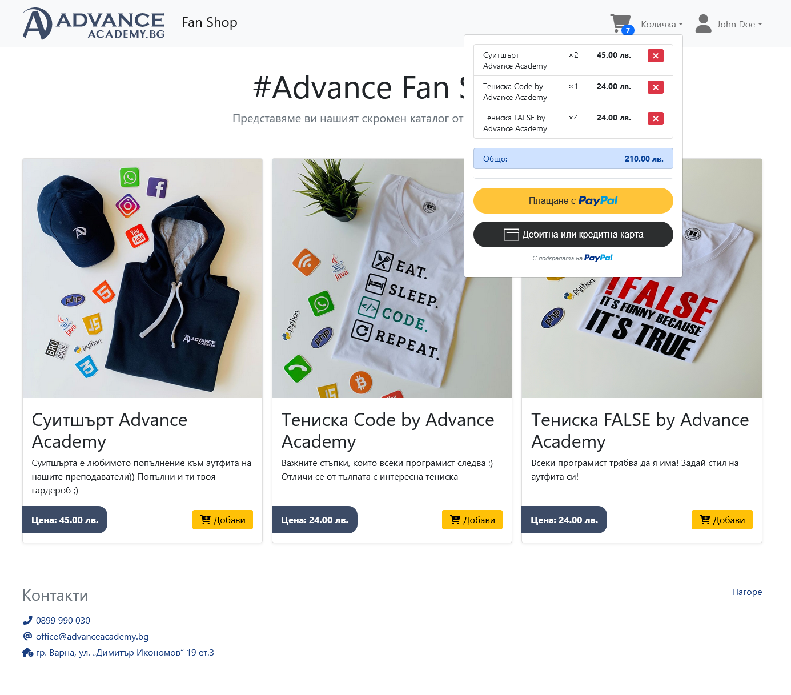

# Shopping Cart DEMO

Този проект съдържа демонстративен скрипт на онлайн магазин с поддръжка на
плащания през системите на PayPal.




## Изисквания

- MySQL сървър
- PHP 7.3+
- Composer пакетен мениджър
- Акаунт в PayPal

## Инициализация

Създайте база в MySQL и импортирайте файла `schema/database.sql` в нея.

Копирайте `src/.env.example` в `src/.env` и променете настройките за базата и
PayPal клиент приложението.

Инсталирайте необходимите пакети чрез:

```bash
composer install
```

## Стартиране

От основната директория на проекта, напишете в конзолата:

```bash
composer start
```
Отворете http://127.0.0.1:8080/

## Потребител

За вход използвайте следните данни:

* **E-mail**: `admin@example.com`
* **Парола**: `password`
